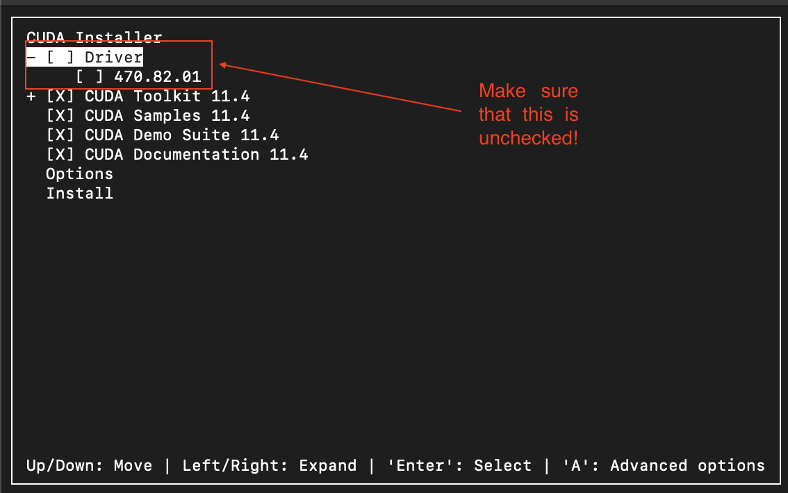
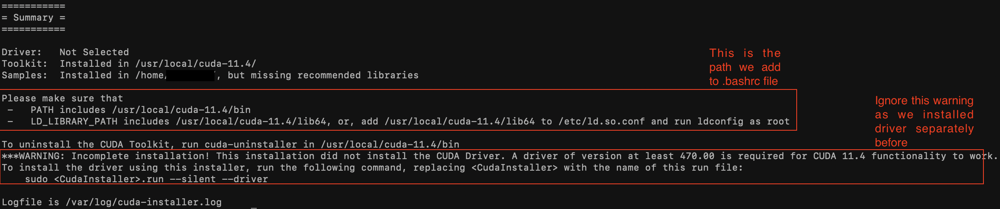
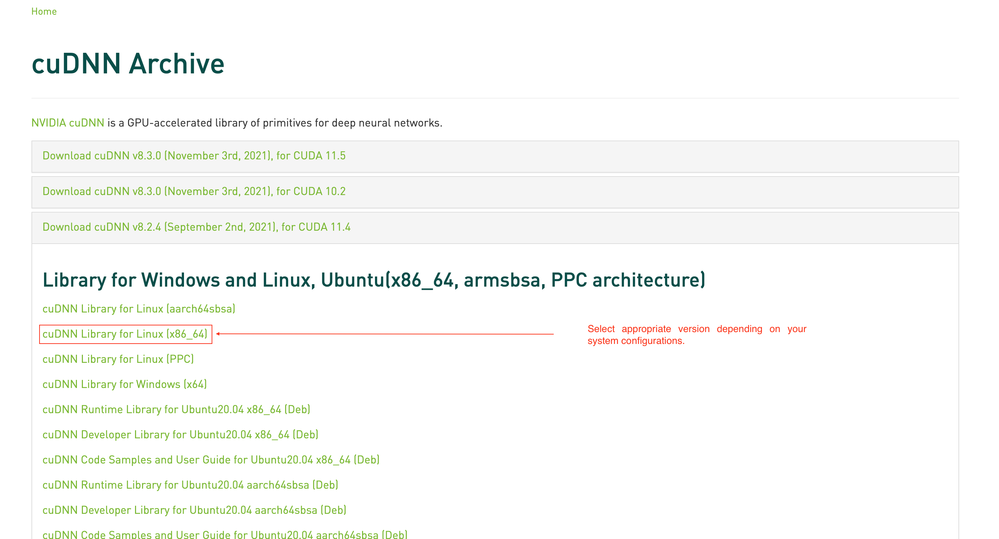
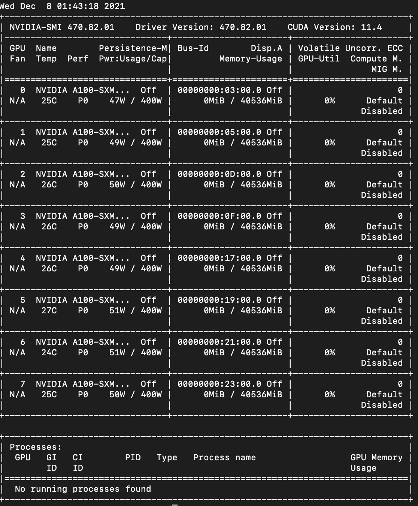
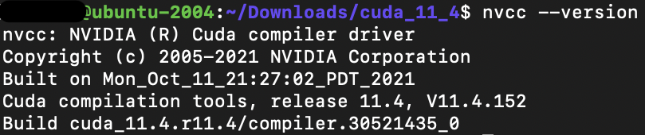

# NVIDIA Driver, CUDA 11.4, cuDNN v8.2.4 installation on Ubuntu 20.04

## Uninstall previous versions

- First of all remove all related versions of NVIDIA driver, CUDA and cuDNN by executing the following commands.

```bash
sudo apt-get --purge remove "*cublas*" "cuda*" "nsight*" 
sudo apt-get --purge remove "*nvidia*"
sudo rm -rf /usr/local/cuda*
sudo apt autoremove
```


## Installation of NVIDIA Drivers, CUDA and cuDNN

### NVIDIA Drivers

- Check driver version for the CUDA version you are going to install.
<https://docs.nvidia.com/cuda/cuda-toolkit-release-notes/index.html>


- After confirming the suitable version, go to this page and download appropriate driver for your GPU:
<https://www.nvidia.com/download/index.aspx?lang=en-us><br>
    In my case, for example, I downloaded `NVIDIA-Linux-x86_64-470.82.01.run`<br>
    Run the following command:<br>
    `sudo sh NVIDIA-Linux-x86_64-470.82.01.run --no-x-check` <br>
    Replace `NVIDIA-Linux-*` with the file you downloaded.

- You just need to approve and accept the prompts. Installation is pretty straightforward.

### Install CUDA matching NVIDIA Driver version

- In this tutorial, I am going to install `CUDA 11.4.3` (Although 11.5 is the latest one at the time of writing this tutorial).

```bash
wget https://developer.download.nvidia.com/compute/cuda/11.4.3/local_installers/cuda_11.4.3_470.82.01_linux.run
```

- After running the below command, make sure that you uncheck NVIDIA Driver option (as shown below) as we have already installed it in the previous step.

```bash
sudo sh cuda_11.4.3_470.82.01_linux.run
```



- After successful installation, you will get a warning message (as shown below) that it did not install CUDA Driver, just ignore it as we had installed it separately before.



### Add CUDA path to the bashrc file

- For programs to be able to recognize the location of CUDA, we must add PATH to the `bashrc` file. Execute the following commands to add CUDA path.

```bash
echo 'export PATH=/usr/local/cuda-11.4/bin:$PATH' >> ~/.bashrc
echo 'export LD_LIBRARY_PATH=/usr/local/cuda-11.4/lib64:$LD_LIBRARY_PATH' >> ~/.bashrc
source ~/.bashrc
sudo ldconfig
```


### Installation of cuDNN matching CUDA version

- Installation of cuDNN is highly recommended to speed up calculations further. You must have an NVIDIA account to download cuDNN. Please create your account before downloading.

- Download cuDNN from here: 
<https://developer.nvidia.com/rdp/cudnn-archive>


- In this tutorial, I am going to install `cuDNN v8.2.4` for `CUDA 11.4`.

- There are several ways to install cuDNN but the simplest is to download the compressed file and extract to relevant CUDA directory.
```bash
tar -xzvf ${CUDNN_TAR_FILE}
```

```bash
sudo cp -P cuda/include/cudnn.h /usr/local/cuda-11.4/include
sudo cp -P cuda/lib64/libcudnn* /usr/local/cuda-11.4/lib64/
sudo chmod a+r /usr/local/cuda-11.4/lib64/libcudnn*
```

## Verify Installation

- If you followed the above steps correctly, NVIDIA drivers, CUDA and cuDNN should have installed correctly.

- Execute `nvidia-smi` and `nvcc --version` to see if everything is working as expected and the CUDA versions match for them.

`nvidia-smi`



`nvcc --version`


## Issues

Feel free to open issues if you face any problem. Thank you!

